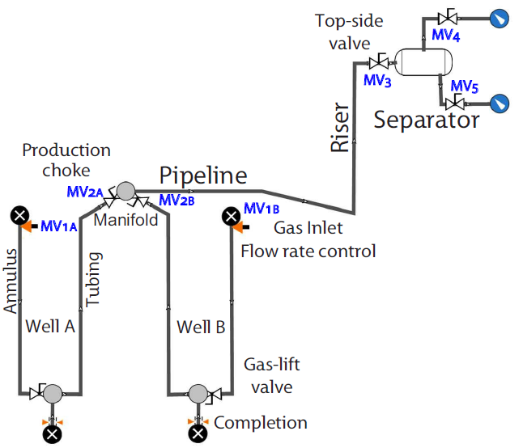

# Introduction 
This repository contains the code and models for simulations in the article "Plantwide control of an oil production network", submitted to [Computers & Chemical Engineering](https://www.journals.elsevier.com/computers-and-chemical-engineering). The article is under review. A draft version of the article is available [here](Article/PlanWideOil_June2019.pdf).

The purpose of this repository is to increase the transparency of our simulation results and provide inspiration for other researchers. The root folder of this repository contains the scripts for the experiments in the paper. However, the software is provided 'as is', without warranty of any kind. Particularly, this software relies on third-party libraries and proprietary software that are constantly updated.  Thus, the authors take no responsibility for code maintenance and installation instructions of any kind.

This project relies on the following open-source third-party libraries:
* [CasADi](https://web.casadi.org/) v 2.0.0
* [JModelica.org](https://jmodelica.org/) v 1.17
* [Ipopt](https://github.com/coin-or/Ipopt)
* [SUNDIALS](https://computing.llnl.gov/projects/sundials) v 0.5
* [Python Control Systems Library](https://sourceforge.net/projects/python-control/) v 0.7.0
* [Python v. 2.7.10](https://www.python.org/downloads/release/python-2710/), together with libraries from the de facto package-management system like numpy and scipy.

Further, this project relied on the following proprietary software
* [Olga](https://www.software.slb.com/products/olga)
* [Dymola](https://www.3ds.com/products-services/catia/products/dymola/)
* [Matlab](https://www.mathworks.com/products/matlab.html)

# Models
## The process
The oil production network, modeled in Olga, is regarded as the process to be controlled. This model is available on this repository on the path /PlantwideControl/olgaModels/. The oil production network model in Olga also holds stabilizing low-level PID controllers
The communication between the Olga Simulator and the controllers was done by OPC Data Access where the Olga OPC Server is a built-in module of the simulator and the OPC client is coded in Python.
## Simplified dynamic model:
The simplified dynamic model of the process is implemented in Modelica. The model components have been developed and tested using the [Dymola](https://www.3ds.com/products-services/catia/products/dymola/) software. The models used in our simulation are available the [networkModels](networkModels/) directory.  

The Modelica model consists of four main components:
- [Well](networkModels/networkComponents/gasliftWell.mo)
- [Manifold](networkModels/networkComponents/manifold.mo)
- [Pipeline-riser](networkModels/networkComponents/pipelineRiser.mo)
- [Separator](networkModels/networkComponents/separatorTwoPhase.mo)

We use these model components to build different [network models](networkModels/gasliftNetworks.mo).

## Olga dynamic model:
The oil production network is simulated using the Olga simulator.
The olga network is shown in the figure in below.

# Controller implementation

The simplified model in Modelica is compiled to a Functional Mock-up Unit (FMU) and imported with CasADi to implement a Nonlinear Model Predictive Control (NMPC).  We implement an Extended Kalman Filter (EKF) (see, /PlantwideControl/StateEstimator/) to estimate the fluid flow state in the oil production network. Then, the latest state estimate is used to instantiate an Open-Loop Nonlinear Optimal Control Problem based on Single-Shooting (see, /PlantwideControl/NMPC).  The NPMC tools relies on Automatic Differentiation tools in CasADi coupled to the IDAS package in SUNDIALS for the solution of differential-algebraic equations (DAE) systems and Ipopt for the solution of the associated Nonlinear Programming problem. Further, the simplified models are also used for analyses aiming at control structure design, e.g., to check controllability, observability, and other input-output gains.

Copyright 2019 Esmaeil Jahanshahi

Permission is hereby granted, free of charge, to any person obtaining a copy of this software and associated documentation files (the "Software"), to deal in the Software without restriction, including without limitation the rights to use, copy, modify, merge, publish, distribute, sublicense, and/or sell copies of the Software, and to permit persons to whom the Software is furnished to do so, subject to the following conditions:

The above copyright notice and this permission notice shall be included in all copies or substantial portions of the Software.

THE SOFTWARE IS PROVIDED "AS IS", WITHOUT WARRANTY OF ANY KIND, EXPRESS OR IMPLIED, INCLUDING BUT NOT LIMITED TO THE WARRANTIES OF MERCHANTABILITY, FITNESS FOR A PARTICULAR PURPOSE AND NONINFRINGEMENT. IN NO EVENT SHALL THE AUTHORS OR COPYRIGHT HOLDERS BE LIABLE FOR ANY CLAIM, DAMAGES OR OTHER LIABILITY, WHETHER IN AN ACTION OF CONTRACT, TORT OR OTHERWISE, ARISING FROM, OUT OF OR IN CONNECTION WITH THE SOFTWARE OR THE USE OR OTHER DEALINGS IN THE SOFTWARE.